# 安装教程
## 准备

> 在Windows上面有许多可以虚拟化Linux的软件

>在这里我只列举WSL2

---

### WSL2安装教程：

| 注意事项 |
| :------: |
| Win10/Win11 |
| CPU开启`虚拟化` |
| 内存建议`8G`及以上 |
| 开启`虚拟化平台` |
> 注意: `虚拟化平台`的开启,必须要Windows10/11专业版或企业版)

### 开始
#### 开始前准备：

1. 查看是否支持虚拟化
```powershell
systeminfo
```
如果显示如下字样,代表电脑已经支持虚拟化,可以安装WSL2.
```
# 第一种情况
Hyper-V 要求:  虚拟机监视器模式扩展: 是
               固件中已启用虚拟化: 是
               二级地址转换: 是
               数据执行保护可用: 是
# 第二种情况
Hyper-V 要求:  已检测到虚拟机监控程序。将不显示 Hyper-V 所需的功能。
```

2. 在电脑任务栏 (或开始菜单中) 搜索`启用或关闭Windows功能`.

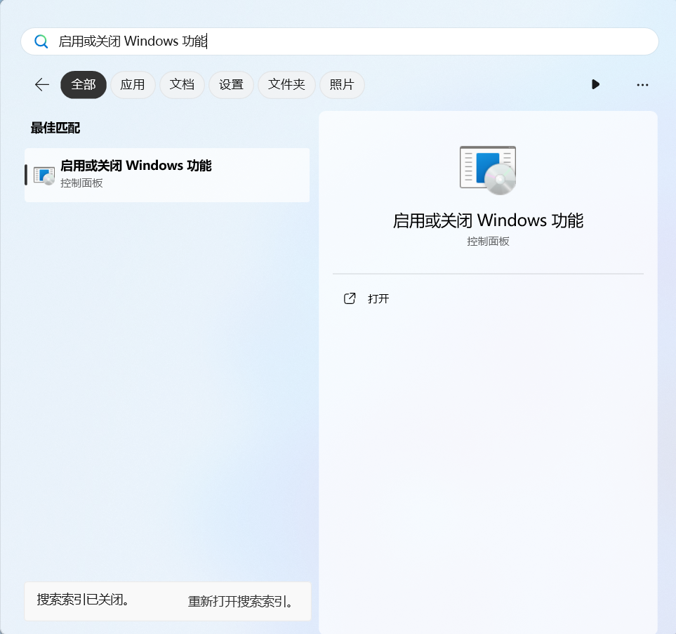

2. 打开后,将`Hyper-V`,`适用于Windows的linux子系统`和`虚拟机平台`打钩

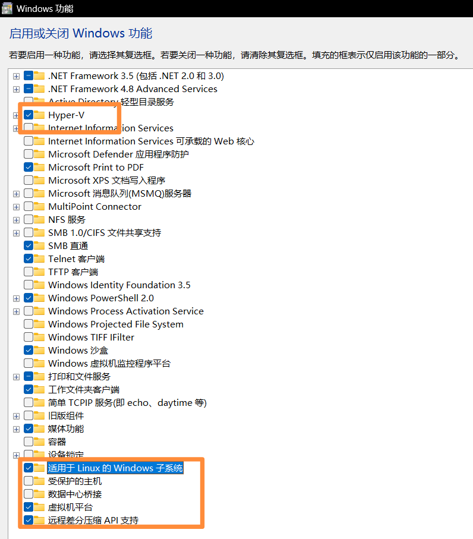

3. 点击左下角的`确定`.

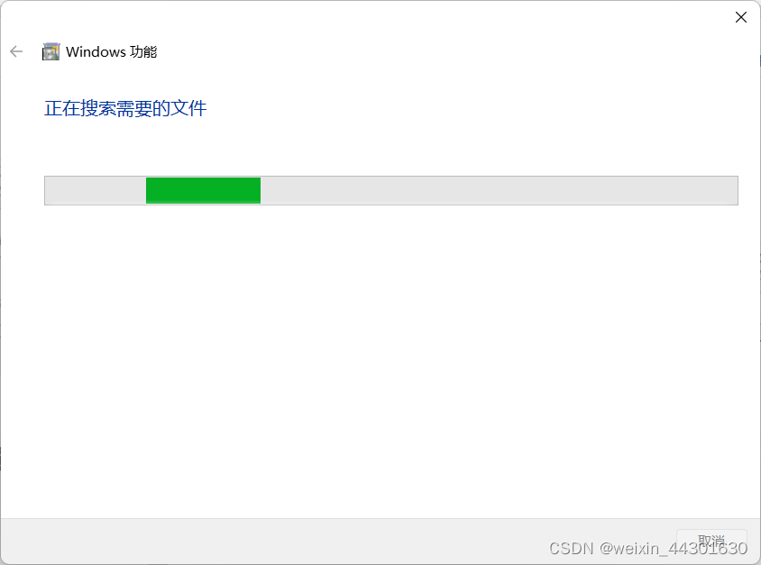

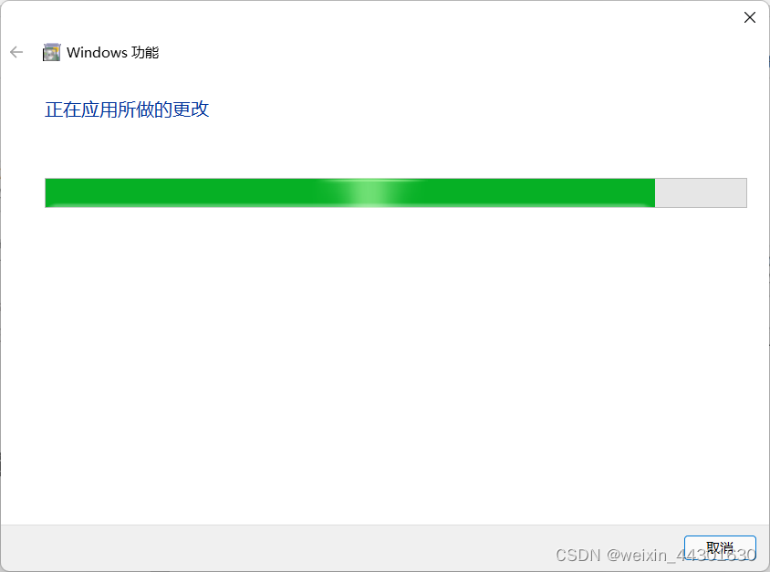

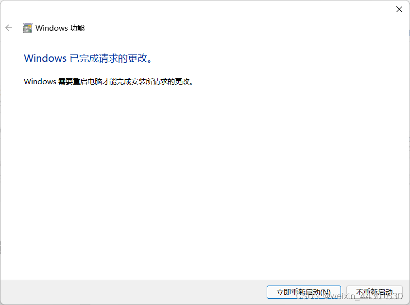

3. 然后根据提示选择 **不重新启动**

| WSL升级文件 |
| :------: |
| [wsl_update_x64.msi](https://wslstorestorage.blob.core.windows.net/wslblob/wsl_update_x64.msi)|

下载此文件并安装,完成之后**再`重新启动` 计算机(电脑)**

---

#### 正式准备安装：
1.在系统内，打开**微软商店**


2.然后搜索`Ubuntu 22.04`,选择`Ubuntu 22.04.3 LTS`,并开始**安装**

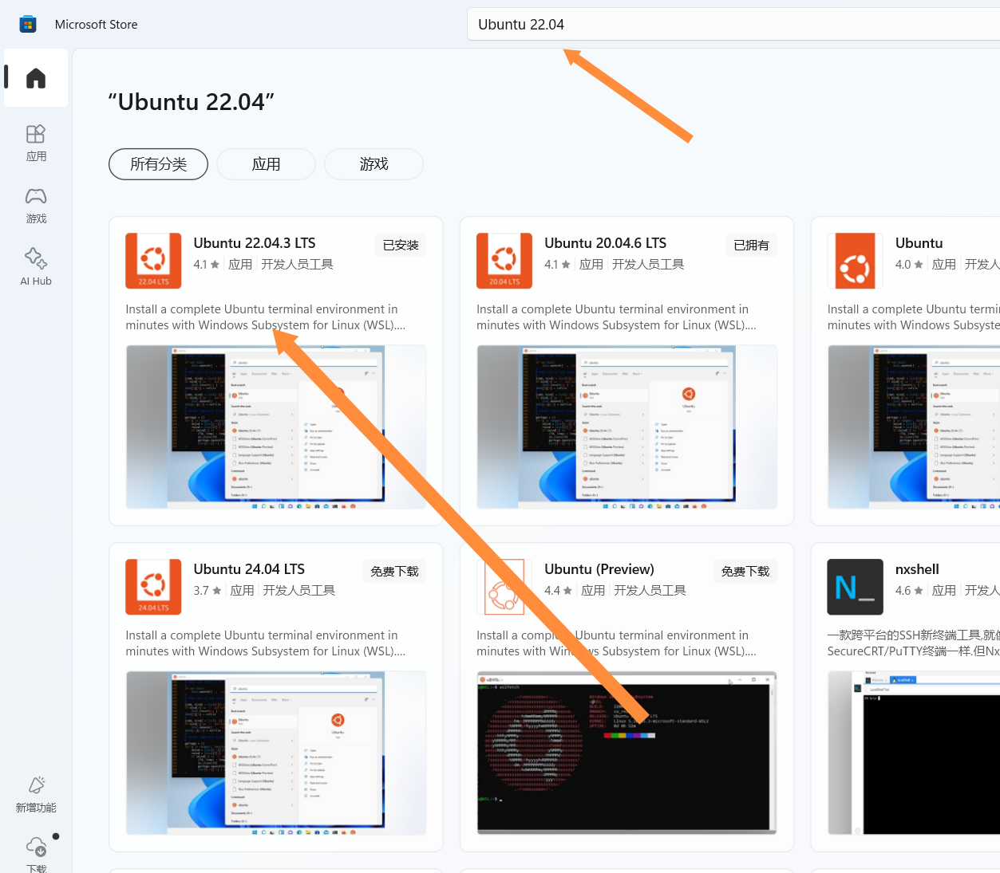

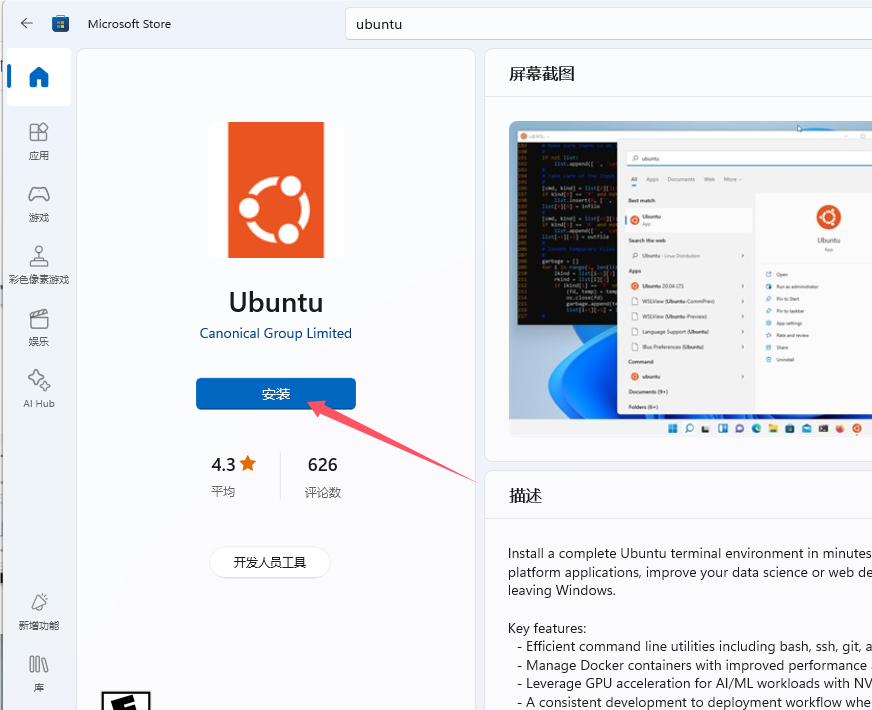

3.安装完成后，打开**Ubuntu 22.04**，然后等待一会，弹出以下界面(tips:如果没有说明，这步可以忽略，后续可以使用**su**命令进入)：


内容为：
#### Installing, this may take a few minutes...
Please create a default UNIX user account. The username does not need to match your Windows username.
For more information visit: https://aka.ms/wslusers

**Enter new UNIX username:**（用户名字）

在此输入你想命名的**名字**，按**回车**下一步.
> 注意: 只能小写

然后弹出输入密码 (New password) ,随便输入即可.
继续回车确认密码 (Retype new password:)

4.弹出以下界面：

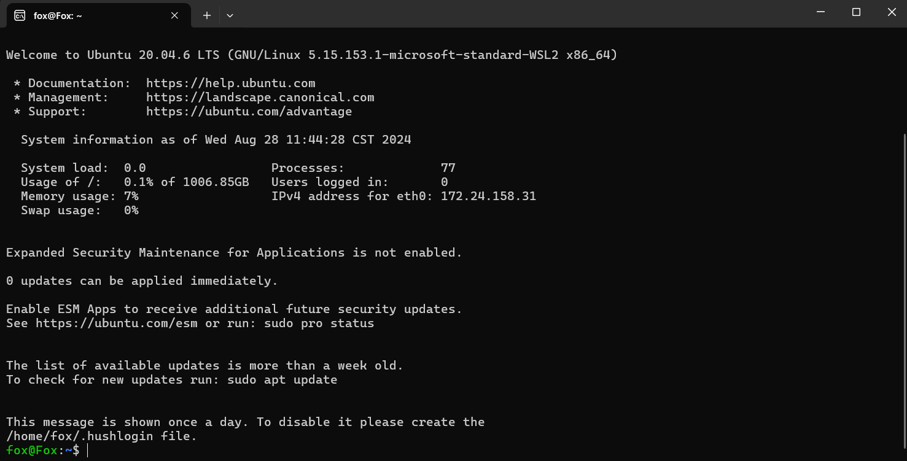

**这里就无需管，直接关掉窗口**，然后打开系统的**终端管理员（或者CMD管理员运行）**，执行
```bash
wsl -d Ubuntu 22.04.3 LTS -u root
```
默认切换至**root**用户；(界面/结果如下）

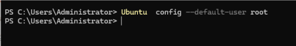

> 这步可做可不做，只要你能手动切换**root**用户也没问题

> 如果上述指令无法切换，尝试把"Ubuntu 22.04.3 LTS"改成发行版名称，查询发行版名称可在cmd执行以下指令

```bash
wsl.exe --list --all
```

5.再次打开**Ubuntu**程序

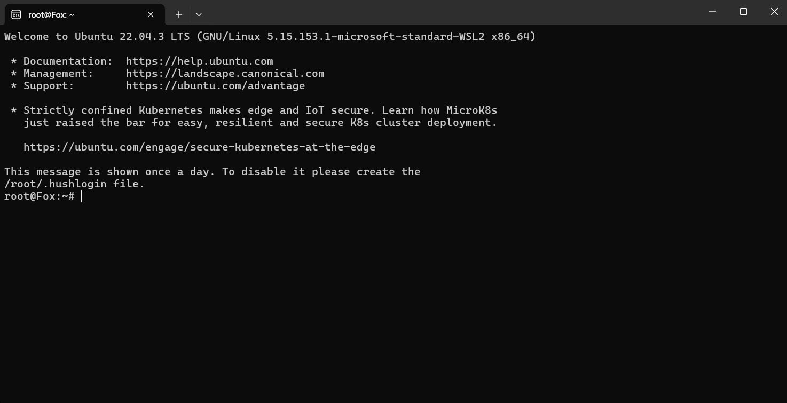

### 开始安装脚本
在此输入
```bash
bash <(curl https://raw.githubusercontent.com/ArcticFox520/Yunzai-Script/main/start)
```
::: details 无法正常运行? 看这里
- 使用下面的命令重新安装
```bash
bash -c "$(curl -L https://mirrors.chenby.cn/https://raw.githubusercontent.com/ArcticFox520/Yunzai-Script/main/start)"
```
:::
提示以下信息

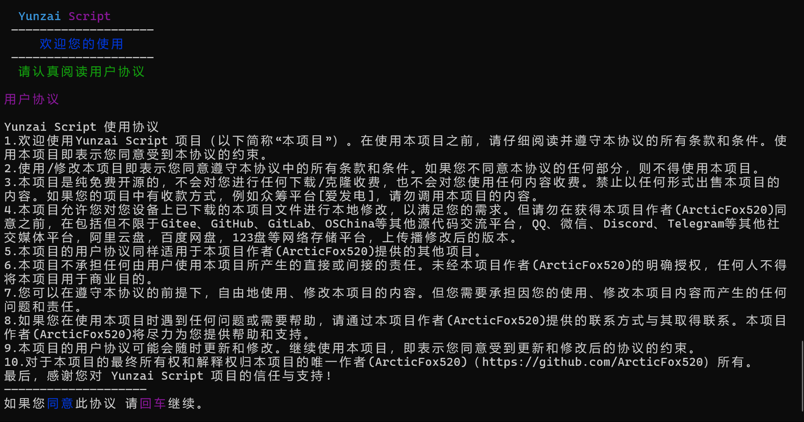

按回车即可开始进行脚本安装；

最后提示
```
- 安装成功
- 请使用 afyz 命令 打开脚本
```
说明脚本已经安装完成
**启动脚本**命令为
```
afyz
```
---
## 注意
在退出之后启动脚本的方式为
- 1. 打开cmd
- 2. 使用下面的命令启动WSL中的Ubuntu22.04
```powershell
wsl Ubuntu
```

>或在搜索框中搜索Ubuntu22.04打开，执行第三步

- 3. 使用下面的命令启动脚本
```bash
afyz
```
